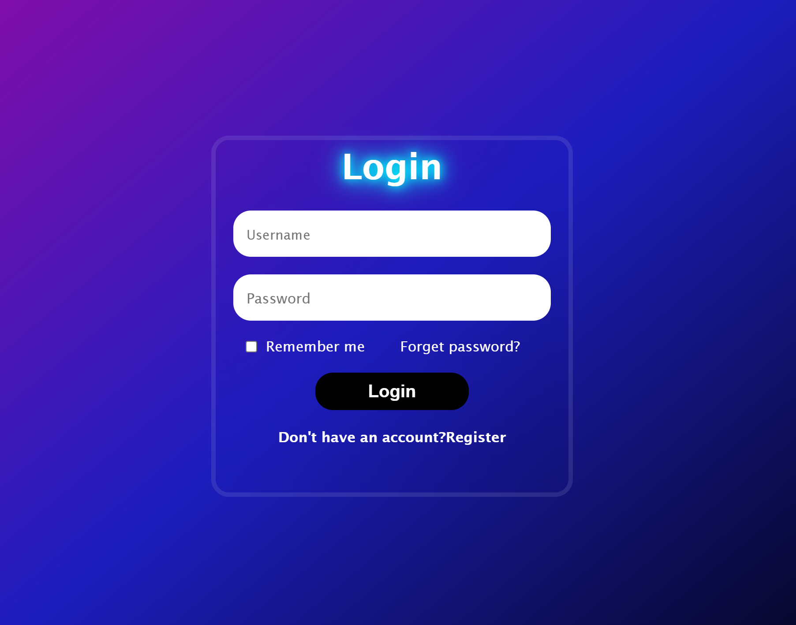

# 🌟 Stylish Login Page | VarunCodeZone

A beautiful and modern **Login Page UI** made with **HTML**, **CSS**, and a bit of **JavaScript**.  
This design features **glassmorphism**, elegant **gradients**, and responsive interactivity to enhance user experience.

---

## 🔥 Preview

---

## 🚀 Features

- 💠 Glassmorphism card with gradient background
- 👤 Username & Password input fields
- ✅ “Remember Me” checkbox
- ❓ “Forget Password?” link
- 🔄 Register suggestion at the bottom
- ✨ Smooth hover effects and transitions
- 📱 Responsive and centered design

---

## 🛠️ Technologies Used

| Technology   | Purpose                |
|--------------|------------------------|
| `HTML5`      | Page structure         |
| `CSS3`       | Styling and layout     |
| `JavaScript` | Optional button logic  |

---

## ⚙️ How to Use

1. **Download** or **clone** this repository.
2. Open `index.html` in your browser.
3. Customize text, links, and logic as needed.
---

## 🎨 Customization Ideas

- 🌓 Add light/dark mode toggle  
- 🔐 Add password visibility toggle  
- 📲 Improve mobile responsiveness  
- 🔗 Connect to Firebase or real authentication  
- 💬 Add error validation and alerts  

---

## 🙌 Created By

Made with ❤️ by **Varun**  
Follow for more cool UI projects:  
- GitHub: [@my-github](https://github.com/varunCodeZone)  

---

## 📄 License

This project is free to use and modify.  
Give credit if you share it publicly — it motivates creators! ✨
